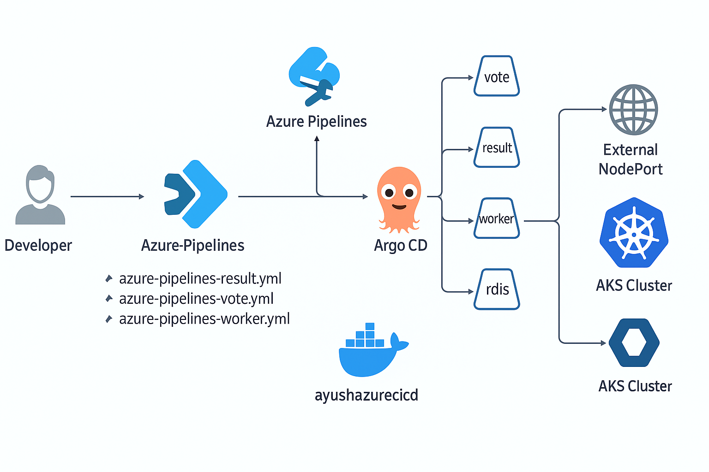
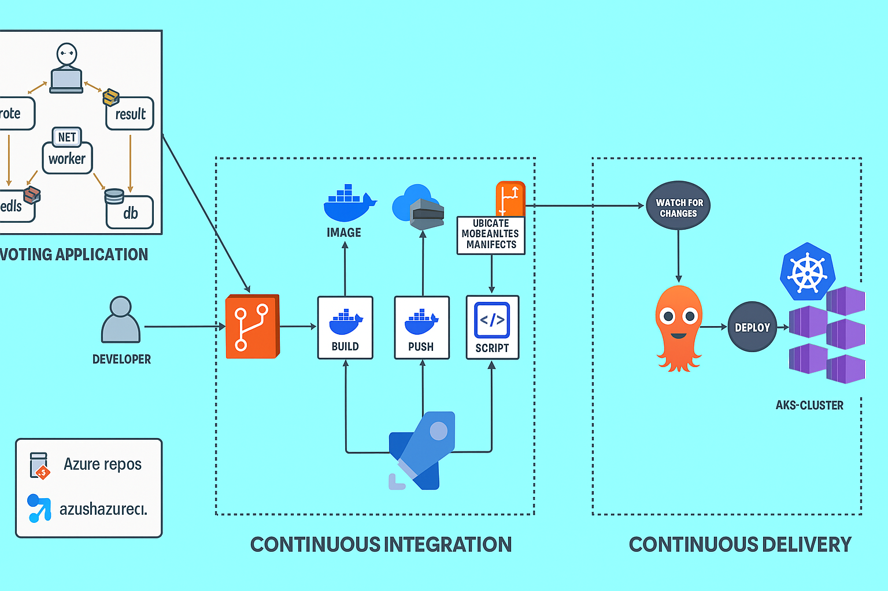

# 🗳️ Voting App Deployment on AKS using Azure DevOps & Argo CD

This project is a complete CI/CD setup for deploying the [Docker Sample Voting App](https://github.com/dockersamples/example-voting-app) to an Azure Kubernetes Service (AKS) cluster using Azure DevOps for Continuous Integration and Argo CD for Continuous Delivery.

---


## 📦 Components

- **Frontend**: Vote App (Python Flask)
- **Backend**: Result App (Node.js)
- **Worker**: .NET Core background processor
- **Database**: PostgreSQL
- **Queue**: Redis

---

## ☁️ Infrastructure Used

| Resource           | Configuration                             |
|--------------------|--------------------------------------------|
| AKS Cluster        | `azuredevops` (1 node pool, Standard_A2_v2) |
| Kubernetes Version | `1.32.5`                                    |
| Region             | Central US                                  |
| Container Registry | `ayushazurecicd` with 3 image repos: `votingapp`, `resultapp`, `workerapp` |

---

## 🔧 CI/CD Stack

### 🔹 Continuous Integration (CI)

- **Azure Pipelines**:
  - `azure-pipelines-vote.yml`
  - `azure-pipelines-result.yml`
  - `azure-pipelines-worker.yml`
- **Steps**:
  - Build Docker images
  - Push to ACR
  - Update Kubernetes manifests (via Bash script)

### 🔹 Continuous Delivery (CD)

- **Argo CD** deployed on AKS
- GitOps approach using Azure Repos
- Auto-sync enabled (`reconciliation.timeout: 10s`)
- Application: `voteapp-service`

---

## 🔄 CI/CD Workflow

1. Developer pushes code to Azure Repos
2. Azure Pipeline:
   - Builds Docker image
   - Pushes to ACR
   - Updates image tag in YAML manifests
3. Argo CD:
   - Detects Git change
   - Syncs updated manifest
   - Deploys new pod to AKS

---

## 📌 How to Reproduce

1. **Fork/Clone this repo**
2. **Provision Azure Resources**:
   - Create AKS and ACR
3. **Set up Service Connections** in Azure DevOps:
   - ACR (Docker Registry connection)
   - AKS (Kubernetes service connection)
4. **Configure Agent Pool**:
   - Use `ubuntu-latest` or custom `azureagent`
5. **Run Pipelines** from Azure DevOps
6. **Install ArgoCD** on AKS:
   ```bash
   kubectl create namespace argocd
   kubectl apply -n argocd -f https://raw.githubusercontent.com/argoproj/argo-cd/stable/manifests/install.yaml



